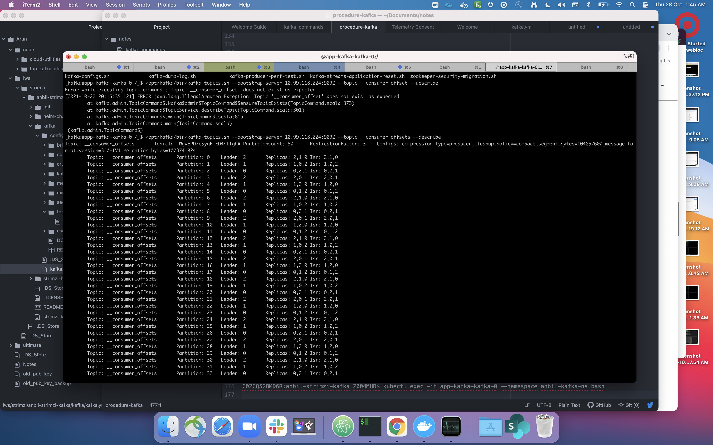
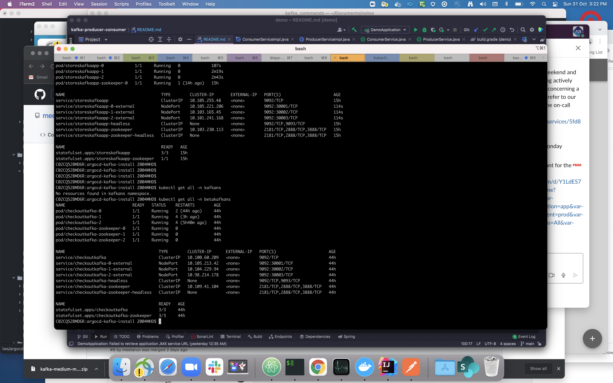
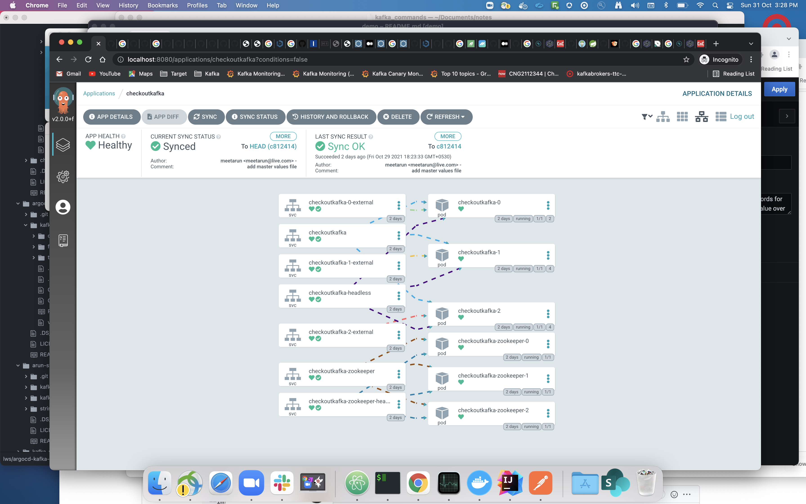

1. #### SpringBoot Based Kafka Producer and Consumer Application

    Repo :  https://github.com/meetarun/kafka-producer-consumer

    To Produce Messages :
   1. Start the spring boot app 
   2. Run the below command or hit the URL in Postman

    
    ```curl --location --request POST 'http://localhost:9000/kafka/publish?message=first-test-msg```

Kafka configs can be found at _resources/application.yml_file_

2. #### Strimzi Kafka Setup 
     
    1. To Install Helm Chart V3 
        ``` brew install helm ```
    2. Add Strimzi Repo to helm chart
       ```helm repo add strimzi https://strimzi.io/charts/```
    3. Create the namespace in minikube using
       ```minikube kubectl create ns anbil-kafka-ns```
   
    4. Customize the strimzi helmchart with our custom namespace
       ```helm template ./strimzi-kafka-operator-helm-3-chart-0.26.0.tgz  --namespace anbil-kafka-ns --output-dir \helm-charts```
    5. Bootstrap the strimzi kafka operator using
       ```helm install strimzi strimzi/strimzi-kafka-operator --namespace anbil-kafka-ns```
    6. Verify Strimzi Kafka Operator is running using
   
      ```
       C02CQ52BMD6R:anbil-strimzi-kafka Z004MHD$ helm ls
       NAME                             	NAMESPACE	REVISION	UPDATED                             	STATUS  	CHART                        	APP VERSION
       strimzi-kafka-operator-1635345900	default  	1       	2021-10-27 20:15:04.819361 +0530 IST	deployed	strimzi-kafka-operator-0.26.0	0.26.0
       C02CQ52BMD6R:anbil-strimzi-kafka Z004MHD$
      ```

    7. Provision the Strimzi cluster using
       ``` kubectl apply -f kafka/kafka.yml -n anbil-kafka-ns ```
    8. Verify the Cluster Pods
   
      ``` C02CQ52BMD6R:anbil-strimzi-kafka Z004MHD$  kubectl get pods  -n anbil-kafka-ns
       NAME                                         READY   STATUS    RESTARTS      AGE
       app-kafka-entity-operator-559986477f-mg42k   1/3     Running   0             12s
       app-kafka-kafka-0                            1/1     Running   0             47s
       app-kafka-kafka-1                            1/1     Running   0             47s
       app-kafka-kafka-2                            1/1     Running   0             47s
       app-kafka-zookeeper-0                        1/1     Running   2 (82s ago)   2m
       app-kafka-zookeeper-1                        1/1     Running   0             2m
       app-kafka-zookeeper-2                        1/1     Running   2 (85s ago)   2m
       strimzi-cluster-operator-85bb4c6-kc48g       1/1     Running   0             5m21s
       C02CQ52BMD6R:anbil-strimzi-kafka Z004MHD$ 
   ```
   
    9. __consumer_offsets Topic in Strimzi app-kafka cluster 
   
   

#### 3.  Kafka Helm Chart Deployment Using GIT-Ops through ArgoCD 

    Helm Chart  Manifests Repo : https://github.com/meetarun/argocd-kafka-manifests 

    ArgoCD Install Repo        : https://github.com/meetarun/argocd-kafka-install

   1. Clone the Repo argocd-kafka-install , we will use ArgoCD helm charts presents in this repo to install our ArogCD
    
   2. Install the ArgoCD from 
   
      ``` helm install argocd argocd-install/argo-cd/ --namespace=argocdns --create-namespace -f argocd-install/values-override.yaml```
   3. Port Forward the ArgoCD service using 
   
       ``` kubectl port-forward service/argocd-server -n argocdn 8080:443```
        Now we can Access ArgoCD UI through http://localhost:8080 
   4. To Login to the UI find the password for admin using below command
      
       ```  kubectl -n argocdns  get secret argocd-initial-admin-secret -o jsonpath="{.data.password}" | base64 -d; echo ```
   5. Login to ArgoCD UI and create an Application via UI or through below maninest and point it to our kafka manifest repo,
``` 
  project: default
source:
  repoURL: 'https://github.com/meetarun/argocd-kafka-manifests.git'
  path: kafka
  targetRevision: HEAD
  helm:
    valueFiles:
      - values.yaml
destination:
  server: 'https://kubernetes.default.svc'
  namespace: betakafkans
syncPolicy:
  automated:
    prune: true
    selfHeal: true
  syncOptions:
    - CreateNamespace=true
   
   ```
 

   7. Make a PR to make config change for Kafka Broker and merge it
        
      https://github.com/meetarun/argocd-kafka-manifests/pull/1/files 

   8. As soon as we merge the PR , ArgoCD will trigger a pipeline and redeploy the running 
Kafka Broker Instances.
        
   _checkoutkafka_ cluster instances 

   9. ArgoCD Application Home Page
    
   

   10. 
   11. 
  
   


